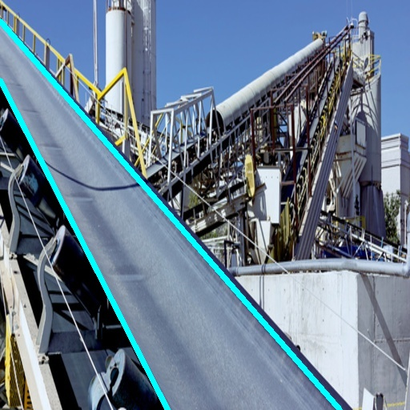
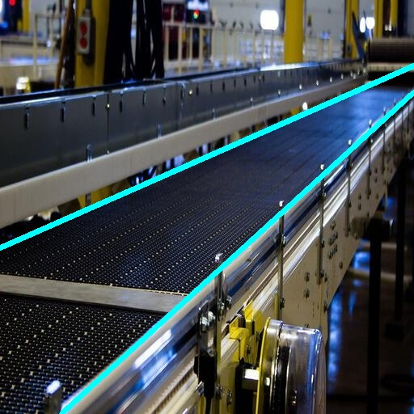
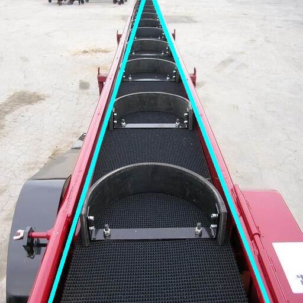

<h1 style="align: center; color: #159957">Deep Hough Transform for Conveyor Detection</h1>

  

### Useful Links:
[Kaggle Notebook with usage example](https://www.kaggle.com/garipovroma/conveyor-detection)

[Dataset on Kaggle](https://www.kaggle.com/datasets/garipovroma/conveyor-detection-dataset)

Pretrained on the [conveyor-detection-dataset](https://www.kaggle.com/datasets/garipovroma/conveyor-detection-dataset) model (based on ResNet50-FPN): [link](https://disk.yandex.ru/d/8XDYkFSbXMutcA)

### Dependecies
Install requirements.txt:
```
pip3 install -r requirements.txt
```

To install deep-hough, run the following commands.
```sh
cd deep-hough-transform
cd model/_cdht
python setup.py build 
python setup.py install --user
```

### Prepare training data
Locate your dataset to `data/` folder in the following format:
- `data/dht_images` folder - for .jpg images
- `data/dht_data` folder - for .txt files in the following format:
`x1 y1 x2 y2 H W` - for each line on the image, where `x1 y1 x2 y2` - two dots representing line, `H` and `W` - image height and weight 
 


Then run python script to generate parametric space label.
```sh
./prepare_data.sh
```
After, run python script to generate train test split.
```sh
./generate_train_test_split.sh
```

### Training
Following the default config file 'config.yml', you can arbitrarily modify hyperparameters.
Then, run the following command.
```sh
python train.py
```


